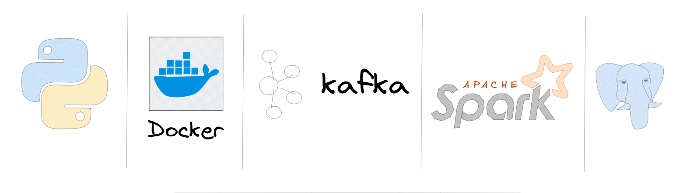
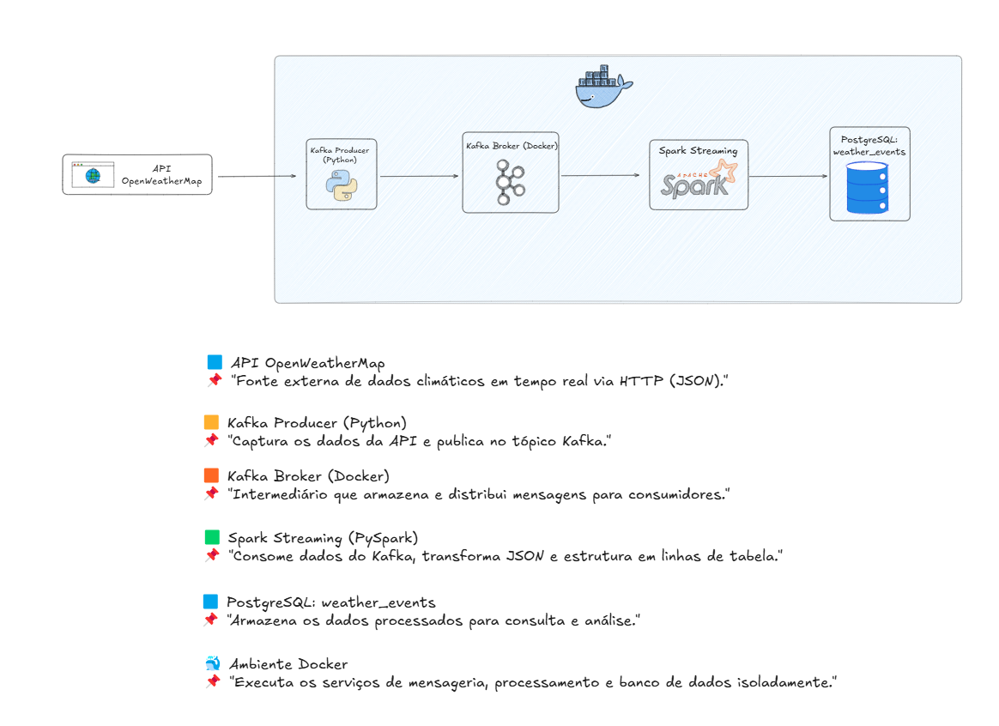

# 🌦️ Projeto de Pipeline Climático com Kafka, Spark e PostgreSQL


Este projeto demonstra como criar um pipeline de dados em tempo real utilizando **Apache Kafka**, **Apache Spark**, **PostgreSQL** e **Docker**, consumindo dados reais da API do OpenWeatherMap sobre o clima em **São Paulo**. O objetivo é simular uma arquitetura robusta de ingestão e processamento de eventos meteorológicos.

<p align="center">
  
</p>


## 🔧 Tecnologias Utilizadas

- [Python 3.10+](https://www.python.org/)
- [Apache Kafka](https://kafka.apache.org/)
- [Apache Spark](https://spark.apache.org/)
- [PostgreSQL 13+](https://www.postgresql.org/)
- [Docker + Docker Compose](https://www.docker.com/)
- Bibliotecas Python:
  - `kafka-python`
  - `requests`
  - `psycopg2-binary`
  - `pyspark`

---

## 📌 Arquitetura do Projeto

<h3 align="center">📊 Arquitetura do Pipeline</h3>

<p align="center">
  
</p>

---

## 🚀 Como Executar o Projeto

### ✅ Forma Rápida (Windows)

Você pode iniciar todo o projeto diretamente com o script:

```bash
init.bat
```

Esse script realiza os seguintes passos:
- Ativa o ambiente virtual `.venv`
- Instala as dependências necessárias
- Sobe os containers com Docker
- Executa o `producer.py`
- Abre um terminal à parte para você rodar o Spark Consumer

---

### 1. Clonar o repositório

```bash
git clone https://github.com/seu-usuario/projeto-climatico.git
cd projeto-climatico
```

### 2. Subir os serviços com Docker

```bash
docker-compose up -d
```

Este comando irá iniciar os seguintes containers:
- Apache Zookeeper (porta 2181)
- Apache Kafka Broker (porta 9092)
- PostgreSQL com o banco `weather_db` e a tabela `weather_events` já criados via script SQL.

---

### 3. Criar ambiente virtual e instalar dependências

```bash
python -m venv .venv
.\.venv\Scripts\activate  # Windows
# ou
source .venv/bin/activate  # Linux/Mac
```

Instalar as dependências:

```bash
pip install -r requirements.txt
pip install -r spark_requirements.txt
```

---

### 4. Rodar o Kafka Producer (enviando dados da API)

```bash
python producer.py
```

Este script envia dados climáticos reais de São Paulo a cada 5 minutos para o tópico Kafka `weather`.

---

### 5. Rodar o Spark Structured Streaming Consumer

```bash
spark-submit spark_consumer.py
```

Esse script:
- Lê os dados do tópico `weather` do Kafka
- Converte os JSONs para DataFrame estruturado
- Escreve no PostgreSQL em modo `append`, com `created_at`

---

## 📊 Estrutura da Tabela PostgreSQL

A tabela `weather_events` é criada automaticamente ao subir o container. Estrutura:

| Coluna          | Tipo              |
|-----------------|-------------------|
| station_name    | VARCHAR            |
| event_timestamp | TIMESTAMP          |
| temperature     | DOUBLE PRECISION   |
| humidity        | DOUBLE PRECISION   |
| precipitation   | DOUBLE PRECISION   |
| wind_speed      | DOUBLE PRECISION   |
| created_at      | TIMESTAMP          |

---

## 📁 Estrutura de Pastas

```bash
projeto-climatico/
├── docker-compose.yml
├── create_tables.sql
├── producer.py
├── spark_consumer.py
├── requirements.txt
├── spark_requirements.txt
├── .gitignore
├── init.bat
└── README.md
```

---

## 🧪 Exemplo de Evento Kafka

```json
{
  "station_name": "Sao Paulo",
  "event_timestamp": "2025-05-04T12:00:00-03:00",
  "temperature": 24.5,
  "humidity": 78,
  "precipitation": 0.0,
  "wind_speed": 3.1
}
```

---

## 💡 Possiveis Melhorias

- Dockerizar o Spark e o Producer
- Criar visualização interativa com Streamlit ou Grafana
- Adicionar camada de monitoramento e alertas
- Expandir para múltiplas cidades ou sensores simulados

---
